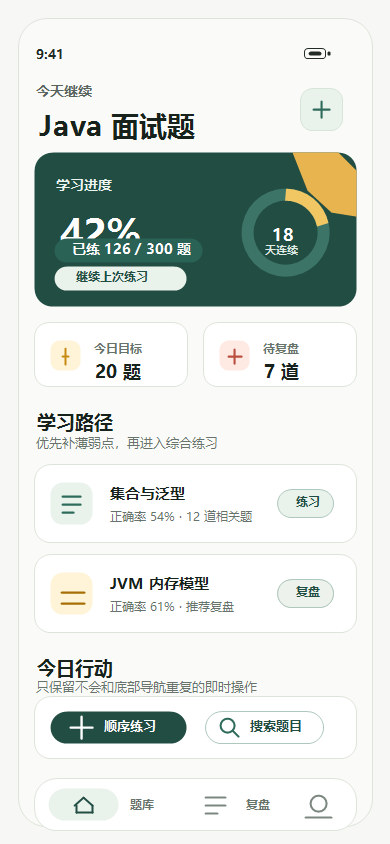

# SuiLearn 随心学

SuiLearn（随心学）是一个面向个人学习者的本地刷题、错题复盘、AI 知识库和 Agent 学习助手项目。项目用 Android App 打通离线 Java 面试题学习闭环，用 Java 后端和 React Web 工作台承载资料导入、AI 生成题、RAG 问答与语义搜索，并在后端提供可流式、可暂停恢复、可观测的 Agent-Native 学习回合运行时。

第一阶段重点是打开即用：无需登录、无需服务端，也能围绕内置 Java 八股学习包完成刷题、收藏、错题本、搜索、知识点学习和统计。第二阶段在不破坏本地闭环的前提下，引入可确认、可追溯的 AI / RAG 能力。当前后端已演进为 Agent-Native 运行时：能力/工具注册表、通用 AgentLoop、LlmClient 流式调用、三层记忆、RAG pipeline、UsageTracker，以及可选的 Bearer 鉴权与 learner 隔离。



## 项目亮点

- Android 离线优先，本地内置 Java 面试学习包。
- 支持单选、多选、判断和简答题四种题型。
- 本地保存答题记录、错题、收藏、搜索、知识点和统计数据。
- Java Spring Boot 后端支持知识库、资料导入、AI 生成草稿、RAG、语义搜索和 Agent-Native 学习助手。
- Agent 回合支持 REST 与 WebSocket 双入口、事件持久化、`afterSeq` 续流、暂停追问、取消与孤儿恢复。
- 内置 `study_agent`、`rag_qa`、`question_generation` 三个能力，工具权限由 capability manifest 强制。
- 三层记忆与滚动会话摘要落 PostgreSQL，RAG 检索经 `pgvector-hybrid` pipeline，usage/cost 进入统一 TurnResult 信封。
- 可选 Phase 8 安全能力：`suilearn.auth.enabled=true` 后 Agent 端点启用 Bearer token 与 learner 隔离，并支持 persona/skills Prompt 注入。
- React + TypeScript Web 工作台承载较重的知识库管理流程。
- 使用 OpenAPI 维护第二版 REST 契约，使用 WS companion schema 维护 WebSocket 命令/事件契约。
- AI 生成内容默认进入待确认状态，用户查看、编辑、保存、丢弃或删除后才会进入正式学习内容。

## 当前状态

| 模块 | 状态 |
| --- | --- |
| Android 本地学习 App | 核心本地闭环已实现；新 Agent 协议客户端延后 |
| Java 八股学习包 | 已内置第一版 50 道题 |
| Backend AI / RAG API | 知识库、资料流水线、RAG、搜索已实现 |
| Agent-Native 运行时 | 三能力循环、REST/WS、三层记忆、RAG pipeline、usage 信封已实现并归档 |
| Phase 8 Agent 鉴权 | Bearer token、learner 隔离、persona/skills Prompt 已实现；默认关闭 |
| Web 知识库工作台 | MVP 已实现 |
| 完整 Web 学习端 | 后续规划 |
| 账号系统、云同步、全站多租户 | 后续规划；现有知识库工作台仍为 trusted single-user |

## 项目结构

```text
SuiLearn
├─ apps/android          Native Android 本地学习 App
├─ apps/web              React + TypeScript 知识库工作台
├─ services/api          Java + Spring Boot 后端 API
├─ contracts/openapi     第二版 REST OpenAPI 契约
├─ contracts/schemas    Agent WebSocket companion schema
├─ docs                  产品、架构、技术选型和协作流程文档
├─ agents                多 Agent 角色边界和执行规则
├─ build.gradle.kts      Android 根 Gradle 配置
└─ settings.gradle.kts   Gradle module 配置，:app 指向 apps/android
```

## 技术栈

| 模块 | 技术 |
| --- | --- |
| Android | Kotlin、Jetpack Compose、Material 3、Navigation Compose、ViewModel、Coroutines、Flow、Room |
| Backend | Java 21、Spring Boot、Spring Web + WebSocket + Security、Spring Data JPA、PostgreSQL、pgvector-ready 持久化模型 |
| Agent | `TurnRuntimeService`、`AgentLoop`、`LlmClient`、`ToolRegistry`、`CapabilityRegistry`、三层记忆、`UsageTracker` |
| AI / RAG | `AiProvider` 抽象，OpenAI-compatible Provider，`RagPipeline`/`ParseEngineRegistry`/`SmartRetriever` |
| Web | React、TypeScript、Vite、lucide-react |
| 契约 | [contracts/openapi/suilearn-v2.yaml](contracts/openapi/suilearn-v2.yaml) |
| 测试 | JUnit、AndroidX Test、Robolectric、Spring Boot Test、TypeScript build checks |

## 快速开始

### 环境要求

- JDK 17 或更高版本。
- Android Studio 或 Android SDK，用于运行 Android App。
- Maven，用于运行后端服务。
- Node.js 和 npm，用于运行 Web 工作台。
- PostgreSQL，用于运行后端 API 和后端集成测试。
- Docker 可选：根目录 [compose.yml](compose.yml) 可一键启动 PostgreSQL、Redis、RabbitMQ、MinIO、API 和 Web；也可只启动部分组件。

> 只想快速跑起来？直接看下文 [Docker 一键启动（全栈）](#docker-一键启动全栈)，无需本地安装 JDK / Maven / Node.js。

### Docker 一键启动（全栈）

最快的体验方式：用仓库根目录的 [compose.yml](compose.yml) 一键拉起 PostgreSQL、后端 API 和 Web 工作台，无需本地安装 JDK、Maven 或 Node.js。

```powershell
Copy-Item .env.example .env
# 按需在 .env 中填入 AI Provider 的 base URL、API Key 和模型名
docker compose up --build -d
```

启动后访问：

| 服务 | 地址 |
| --- | --- |
| Web 工作台 | http://localhost:5174 |
| 后端 API | http://localhost:8080/api/v2 |
| PostgreSQL | localhost:5432 |

说明：

- Web 容器内的 Nginx 默认把 `/api` 反向代理到后端容器，前端默认通过 `/api/v2` 同源访问后端，无需额外配置跨域。
- API 和 PostgreSQL 已配置健康检查；首次启动需等待数十秒后端就绪，API 容器会在数据库未就绪时自动重启恢复。
- 端口、数据库账号密码和 AI 配置都可在 `.env` 中覆盖（见 [.env.example](.env.example)）。
- 不填 AI 相关变量也能启动，但 AI 生成、RAG、语义搜索和 Agent 回合功能不可用。
- Agent 总开关 `SUILEARN_AGENT_ENABLED` 默认 false；WebSocket 子开关 `SUILEARN_AGENT_WEBSOCKET_ENABLED` 默认 true。

常用命令：

```powershell
docker compose logs -f          # 查看日志
docker compose down             # 停止并移除容器（保留数据卷）
docker compose down -v          # 同时删除 PostgreSQL 数据卷
```

如果只想用 Docker 跑数据库、其余服务本地启动，请使用下文的 [本地 PostgreSQL / pgvector](#本地-postgresql--pgvector)。

### Docker 与本地混合启动

根目录 `compose.yml` 当前组件服务为：`postgres`、`redis`、`rabbitmq`、`minio`、`api`、`web`。前端和后端各自只有一个 Docker image。默认配置统一走宿主机发布端口：Web 容器访问 `host.docker.internal:8080`，API 容器访问 `host.docker.internal:5432`。因此 Docker 后端、本地 Maven 后端、Docker 数据库、本地数据库在默认端口下无需手动切换环境变量。

常用组合：

| 目标 | 命令 |
| --- | --- |
| 只用 Docker 启动数据库 | `docker compose up -d postgres` |
| Docker 数据库 + 本地 Maven 后端 | `docker compose up -d postgres` 后运行 `mvn -f services/api/pom.xml spring-boot:run` |
| Docker 数据库 + Docker 后端 | `docker compose up --build -d postgres api` |
| Docker 后端 + 本地 Vite 前端 | `docker compose up --build -d postgres api` 后在 `apps/web` 运行 `npm run dev` |
| Docker 前端 + 本地 Maven 后端 | 本地后端监听 `8080` 后运行 `docker compose up --build -d web` |
| Docker 全栈 | `docker compose up --build -d` |

例如 PostgreSQL 和 Web 工作台跑在 Docker 中，后端 API 用本地 Maven / IDE 启动：

```powershell
Copy-Item .env.example .env
docker compose up -d postgres

docker compose up --build -d web

# 另开一个终端启动本地后端
mvn -f services/api/pom.xml spring-boot:run
```

默认要求本地后端监听：

```text
http://localhost:8080/api/v2
```

如果本地后端端口不是 `8080`，可覆盖 Web 容器代理上游：

```powershell
$env:SUILEARN_API_UPSTREAM="http://host.docker.internal:8081"
docker compose up --build -d web
```

Docker API 默认也经宿主机发布端口连接数据库，所以 Docker 数据库和本地数据库默认都不需要切换配置。如果数据库不在默认宿主机端口，可覆盖数据库连接地址：

```powershell
$env:SUILEARN_DB_URL="jdbc:postgresql://host.docker.internal:5432/suilearn"
docker compose up --build -d api
```

如果默认 Web 端口 `5174` 已被占用，可在 `.env` 中设置其他端口，例如 `SUILEARN_WEB_PORT=5175`。

切回默认端口前，如果当前 PowerShell 会话里设置过自定义上游，先清掉环境变量：

```powershell
Remove-Item Env:\SUILEARN_API_UPSTREAM
Remove-Item Env:\SUILEARN_DB_URL
```

### Android App

构建 Debug 包：

```powershell
.\gradlew.bat :app:assembleDebug
```

运行 Android 单元测试：

```powershell
.\gradlew.bat :app:testDebugUnitTest
```

也可以用 Android Studio 打开项目根目录，直接运行 `app` module。

### Backend API

后端默认使用 PostgreSQL 和 OpenAI-compatible Provider。先准备本地配置：

```powershell
docker compose up -d postgres
docker compose exec postgres psql -U suilearn -d suilearn -c "CREATE EXTENSION IF NOT EXISTS vector;"
Copy-Item services/api/config/local.properties.example services/api/config/local.properties
```

然后在环境变量中提供真实 API Key：

```powershell
$env:SUILEARN_AI_API_KEY="你的 API Key"
```

启动后端：

```powershell
mvn -f services/api/pom.xml spring-boot:run
```

运行后端测试：

```powershell
$env:SUILEARN_TEST_DB_URL="jdbc:postgresql://localhost:5432/suilearn_test"
$env:SUILEARN_TEST_DB_USERNAME="suilearn"
$env:SUILEARN_TEST_DB_PASSWORD="suilearn_dev_password"
mvn -f services/api/pom.xml test -q
```

默认 API 地址：

```text
http://localhost:8080/api/v2
```

### Web 工作台

安装依赖并启动 Vite：

```powershell
cd apps/web
npm install
npm run dev
```

Vite 开发服务默认监听 `http://localhost:5174`，并把 `/api` 代理到 `http://localhost:8080`。构建 Web 应用：

```powershell
npm run build
```

## 本地 PostgreSQL / pgvector

本地开发和测试默认使用 PostgreSQL。可用 Docker Compose 启动本地数据库：

```powershell
docker compose up -d postgres
docker compose exec postgres psql -U suilearn -d suilearn -c "CREATE EXTENSION IF NOT EXISTS vector;"
Copy-Item services/api/config/local.properties.example services/api/config/local.properties
```

配置模板使用本地默认值：

```properties
spring.datasource.url=jdbc:postgresql://localhost:5432/suilearn
spring.datasource.driver-class-name=org.postgresql.Driver
spring.datasource.username=suilearn
spring.datasource.password=suilearn_dev_password
```

也可以用环境变量覆盖：

```powershell
$env:SUILEARN_DB_URL="jdbc:postgresql://localhost:5432/suilearn"
$env:SUILEARN_DB_DRIVER="org.postgresql.Driver"
$env:SUILEARN_DB_USERNAME="suilearn"
$env:SUILEARN_DB_PASSWORD="suilearn_dev_password"
```

不要提交真实 API Key、`.env` 文件或 `services/api/config/local.properties`。

## AI Provider 配置

默认 Provider 类型：

```properties
suilearn.ai.provider=openai-compatible
```

OpenAI-compatible Provider 需要配置 base URL、API Key、聊天模型和 embedding 模型。普通单 Provider 配置如下：

```properties
suilearn.ai.provider=openai-compatible
suilearn.ai.base-url=https://api.openai.com/v1
suilearn.ai.api-key=${SUILEARN_AI_API_KEY}
suilearn.ai.chat-model=gpt-4.1-mini
suilearn.ai.embedding-model=text-embedding-3-small
```

也可以用环境变量覆盖：

```powershell
$env:SUILEARN_AI_PROVIDER="openai-compatible"
$env:SUILEARN_AI_BASE_URL="https://api.openai.com/v1"
$env:SUILEARN_AI_API_KEY="你的 API Key"
$env:SUILEARN_AI_CHAT_MODEL="gpt-4.1-mini"
$env:SUILEARN_AI_EMBEDDING_MODEL="text-embedding-3-small"
```

如果聊天模型和 embedding 模型来自不同服务，可以拆分配置。DeepSeek 当前适合作为聊天 Provider；资料导入、RAG 检索和知识点抽取仍需要一个支持 `/embeddings` 的 OpenAI-compatible 服务：

```properties
suilearn.ai.provider=openai-compatible
suilearn.ai.chat-base-url=https://api.deepseek.com
suilearn.ai.chat-api-key=${SUILEARN_AI_CHAT_API_KEY}
suilearn.ai.chat-model=deepseek-chat
suilearn.ai.embedding-base-url=https://api.openai.com/v1
suilearn.ai.embedding-api-key=${SUILEARN_AI_EMBEDDING_API_KEY}
suilearn.ai.embedding-model=text-embedding-3-small
```

DeepSeek 模型名必须使用账号可访问的实际模型，例如 `deepseek-chat`、`deepseek-reasoner` 或官方兼容期内仍可用的模型名。`chat-base-url` 不要写 `/v1`，因为 DeepSeek 官方 OpenAI-compatible base URL 是 `https://api.deepseek.com`。

后端状态接口会返回脱敏后的 Provider 状态，不会暴露 API Key 原文。

## Agent 鉴权与 Learner Profile（Phase 8，可选）

默认 `SUILEARN_AUTH_ENABLED=false`，Agent 端点保持 trusted single-user 兼容。开启鉴权：

```properties
suilearn.auth.enabled=true
suilearn.auth.tokens=[{"token":"replace-with-a-long-token","learnerId":"learner-a"}]
```

或使用环境变量：

```powershell
$env:SUILEARN_AUTH_ENABLED="true"
$env:SUILEARN_AUTH_TOKENS='[{"token":"replace-with-a-long-token","learnerId":"learner-a"}]'
```

开启后：

- `/api/v2/agent/**` 需要 `Authorization: Bearer <token>`；无 token 返回 401，错 token 返回 403。
- WebSocket `/api/v2/ws` 支持 Authorization header，浏览器受限时可使用 `?access_token=...`。
- 请求中的 `learnerId` 会被 token 对应的 principal learnerId 覆盖；turn、events、cancel、reply、active-turn 均按 learner 隔离。
- 可维护 `GET/PUT /api/v2/agent/learners/{learnerId}/profile`，保存 persona 与 skills；回合构建时自动注入对应 PromptBlock。

## 常用检查

提交或交付前建议运行：

```powershell
# Android 单元测试
.\gradlew.bat :app:testDebugUnitTest

# 后端测试（含 Testcontainers 时需 Docker）
mvn -f services/api/pom.xml test -q

# Web 生产构建
cd apps/web
npm run build
```

## 持续集成

仓库通过 GitHub Actions 在 `main` 分支 push 和 Pull Request 时自动运行 CI，工作流定义见 [.github/workflows/ci.yml](.github/workflows/ci.yml)，包含以下并行任务：

| 任务 | 内容 |
| --- | --- |
| Workflow Policy | 校验改动是否符合 SuiLearn 协作流程约定 |
| Android | 运行单元测试并构建 Debug APK |
| Backend | 基于 PostgreSQL 服务容器运行后端测试；本仓库当前 Docker 全量回归 419 tests 全绿 |
| Web | 安装依赖、运行测试并执行生产构建 |

本地复现 CI 检查可运行上文 [常用检查](#常用检查) 中的命令。

## 文档入口

- 产品规格：[docs/product-requirements.md](docs/product-requirements.md)
- 架构设计：[docs/architecture.md](docs/architecture.md)
- 技术选型：[docs/tech-selection.md](docs/tech-selection.md)
- 开发流程：[docs/development-workflow.md](docs/development-workflow.md)
- 文档索引：[docs/index.md](docs/index.md)
- 第二版 API 契约：[contracts/openapi/suilearn-v2.yaml](contracts/openapi/suilearn-v2.yaml)

`docs/chat.md` 是灵感讨论材料，不是正式产品事实源。

## 开发约定

- 修改代码前先阅读 [AGENTS.md](AGENTS.md) 和对应 `agents/*.md` 角色文件。
- 遵守文件归属和角色边界，保持改动范围清晰。
- 第二版 API 变更先更新 OpenAPI，再同步后端和 Web 消费端。
- AI 生成内容未经用户确认，不得进入正式学习内容。
- 更新内置题包时必须保留 Android 本地学习记录。
- 不提交本地密钥、生成凭据或机器私有配置。

## 路线图

| 阶段 | 重点 |
| --- | --- |
| v1 | Android 离线 Java 面试学习闭环 |
| v2 | AI 生成草稿、知识库、资料导入、RAG、语义搜索和 Web 工作台 |
| v3 | Agent-Native 学习助手运行时；Phase 8 可选鉴权与 learner profile；完整 Web 学习端仍后续规划 |

## License

当前仓库尚未声明开源许可证。若要作为可复用开源项目发布，请先补充 License。
