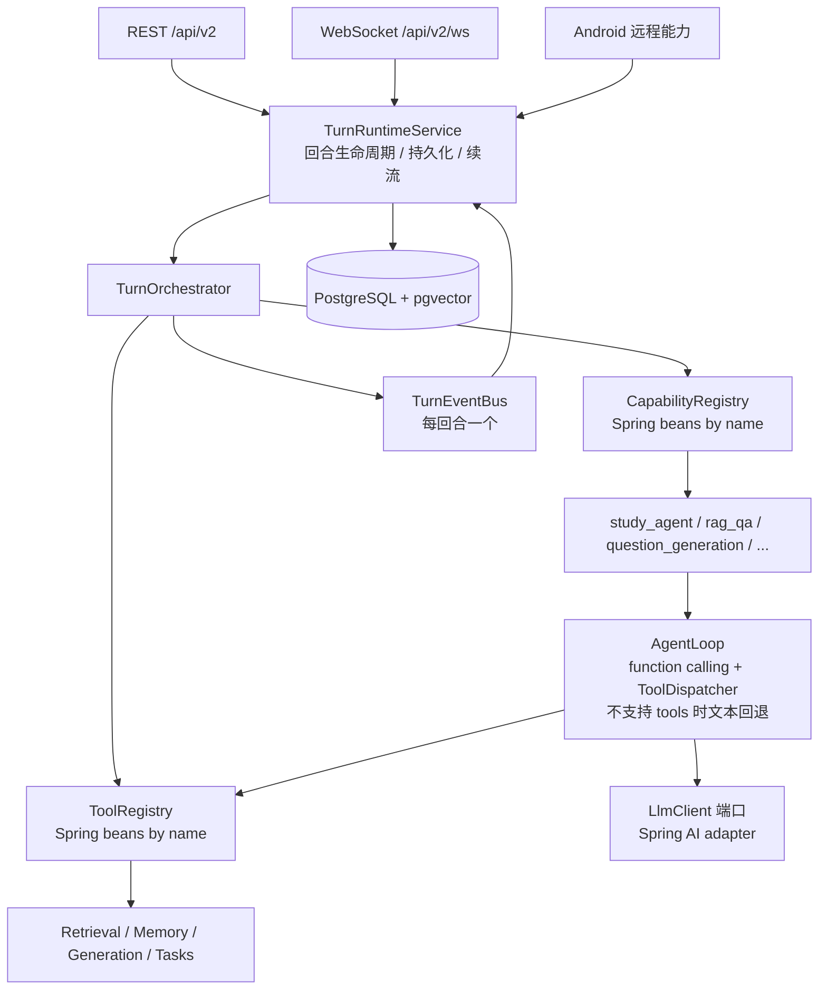

# SuiLearn 学习助手 Agent 改造计划（Agent-Native Runtime）

| 项目 | 内容 |
|---|---|
| Status | Draft |
| Base Branch | `dev` |
| Base Ref | `f1c68b6` |
| Created | 2026-08-15 |
| Change Intent | 参照 DeepTutor 的 agent-native 架构，把 SuiLearn 现有学习 Agent MVP 改造成可路由、可流式、可暂停恢复、可扩展的学习助手 Agent 运行时。 |
| Scope | Architecture / Contracts / Backend / Web / Android / Test |

> 本文是独立保存的改造计划草稿，不直接修改业务代码，也不是 OpenSpec change 产物。后续若要进入 SuiLearn 工作流，应先在 `openspec/changes/<change-name>/**` 创建正式变更包，经 Spec 评审批准后再实施。
>
> **兼容性边界**：本计划不考虑旧代码和旧数据的兼容。旧 `LearningAgentPort` / ReactAgent / 旧 REST 端点及旧 Redis、旧语义记忆数据在对应阶段直接替换或删除，不提供 legacy 双跑、在线迁移、只读 bootstrap 或兼容回退开关。

---

## 0. 目标与验收边界

### 0.1 产品成功标准

“真正可用的学习助手 Agent”不等于“把同步 RAG 接口改成流式输出”。改造完成后，SuiLearn 应稳定提供以下端到端体验：

1. 用户在指定知识库或单份资料范围内提问，能够实时看到学习过程，并在结束时得到带已验证引用的讲解、临时练习和下一步建议；证据不足时必须明确表达不确定。
2. 同一 `sessionId` 内的追问能够复用最近学习上下文；跨会话能够召回可追溯的学习目标、偏好、薄弱点和掌握状态。
3. WebSocket 或移动网络断线后，客户端可以按 `afterSeq` 继续接收同一回合，不重复消费已完成事件。
4. Agent 需要用户补充信息时，回合进入 `WAITING_INPUT`；用户回复后从原工具调用继续，不需要重跑整个回合。
5. 同一运行时可以路由 `study_agent`、`rag_qa`、`question_generation` 等能力；新增工具只实现注册协议并声明权限，不改循环调度器。
6. Android 本地刷题、错题、收藏和统计在不连接 Backend 时仍完全可用；AI 内容仍必须经用户确认后才能沉淀为正式题目。
7. 每次 LLM 请求有可审计的 token、预算、成本和失败路径；指标与日志不泄露用户正文、Prompt、原始模型输出或 API 密钥。

### 0.2 端到端能力矩阵

| 能力 | 用户入口 / 触发 | 本轮工具面 | 用户可观察结果 | 现有 MVP 对应物 |
|---|---|---|---|---|
| `study_agent`（默认） | 指定 KB/资料提问；错题或知识点补学 | `search_knowledge`、`read_evidence`、`generate_practice`、`recall_memory`、`persist_memory`、`ask_user` | 流式讲解、引用、临时练习、下一步建议、记忆状态；无证据时不确定 | 固定 Supervisor + 2 个 SubAgent 的完整闭环 |
| `rag_qa` | 直接资料问答 | `search_knowledge`、`read_evidence` | 低延迟问答、引用、不确定表达，不默认生成练习 | `RagService.ask` 的轻量问答路径 |
| `question_generation` | 从题目、知识点、错题、资料或 KB 生成题目 | `generate_questions`（或 deferred `generate_practice`） | 返回临时草稿，由现有内容确认流程保存/编辑/丢弃 | 现有 generation 模块与 `PracticeCoachSubAgent` |
| 会话追问 | 同 `sessionId` 继续提问 | 默认 `study_agent` 工具面 | 使用会话摘要与长期记忆回答，不要求重复提供 scope | `SessionMemoryService` + `MemoryManager` |
| 暂停追问 | Agent 检测到目标、难度或内容缺失 | `ask_user` | `WAITING_INPUT` 卡片；用户回复后继续 | 无，本次新增 |

能力路由规则：

- `TurnContext.capability()` 显式指定时使用该能力；非法能力在回合启动时返回契约错误。
- 未指定时默认 `study_agent`；只有 `rag_qa` 能保持当前同步 RAG 问答的轻量行为。
- `question_generation` 只产出临时草稿；正式内容保存仍走现有 generation 模块和 AI 内容确认门禁。来源通过 `SourceSelection` 结构化传入；完整生成任务继续复用现有 durable task，Agent 轮内只允许有界轻量生成或提交后返回 `taskId` 轮询。
- 工具允许集由 `CapabilityManifest.ownedTools()` + `ToolDefinition.requiredScopes()` 计算；Agent 无权运行时扩大权限。
- 新 WS/REST 仍遵守现有 `suilearn.agent.enabled` 开关；`enabled=false` 时统一返回现有 AGENT_UNAVAILABLE 语义。

### 0.3 必须保持的 SuiLearn 产品约束

| 约束 | 架构处理 |
|---|---|
| Android 本地闭环离线可用 | 远程 Agent 只位于 `core/remote` 和 `feature/ai`；本地刷题路径不依赖新运行时 |
| AI 生成内容不能自动进入正式题库 | Agent 工具只读或返回临时草稿；保存仍走 generation 的确认门禁 |
| KB 与资料范围不可越过 | `TurnContext.scope` 是强制服务端参数；每个检索工具复用 `Retriever.RetrievalRequest` 的 scope 校验 |
| `question_generation` 来源必须结构化校验 | 知识点/题目/错题/资料/KB 通过 `SourceSelection` 传入，服务端校验存在性、归属 KB 与 learner 可见性，不能依赖自然语言自由指定 |
| 回答必须可溯源、不确定时必须表达不确定 | `read_evidence` 只返回稳定 `sourceRef`；结果信封保留 citations/uncertain |
| 外部资料、历史消息、记忆和工具结果不可信 | Context 按 block 隔离；系统安全契约不可裁剪；工具输入长度、引用和 scope 单独验证 |
| `learnerId` 当前只是逻辑标识，不是身份 | 新契约沿用该语义；公网鉴权与多租户放到 Phase 8 的独立安全 change |

### 0.4 非目标

- 不把 SuiLearn 重构为 DeepTutor 的 Python 复制品，只复用其运行时架构原则。
- 不在本轮引入 MCP 插件市场、动态 Tool/Skill 安装、Shell/浏览器/任意 URL 工具或代码沙箱。
- 不实现账号体系、云同步、社区、多租户权限或完整学习计划系统。
- 不兼容、不迁移旧 Redis/pgvector 记忆数据；新记忆系统从空库冷启动，旧数据只允许离线归档或直接删除。

### 0.5 基础设施保留与移除决策

- **RabbitMQ：保留，但只服务现有 durable 长任务**（资料导入/解析、知识点生成、题目生成及其重试/DLQ）。Agent 回合事件流、WebSocket 实时推送和记忆合并调度不依赖 Rabbit。
- **Redis：不再进入新 Agent 运行时**。会话摘要改为 PostgreSQL 表，删除新 Agent 对 `StringRedisTemplate` 的依赖；旧 Redis 只作废弃数据清理。
  - 注意：Redis 只是旧实现的存储后端，不是记忆层本身。去掉 Redis 后仍有会话记忆、L1 审计、L2/L3 长期记忆和 pgvector 语义召回索引。
- **PostgreSQL/pgvector：唯一事实源**。`turn`、`turn_events`、`session_message`、会话摘要、L1/L2/L3 记忆、索引版本全部落 PostgreSQL。L2/L3 的逻辑格式是 Markdown，但以 PostgreSQL text/jsonb 列保存，不直接写仓库文件。
- **MinIO：保留**，仅用于原始资料、OCR 中间产物和生成附件。
- **Spring AI Alibaba Agent Framework：移除**。`LlmClient` 默认基于现有 `OpenAiCompatibleAiProvider` 的 `java.net.http` 模式实现流式 chat + function calling，不新增 Spring AI 2.0/LangChain4j；确需 Spring AI 时只保留 chat client 依赖，不保留 graph/agent。

### 0.6 会话原文保留策略

- **保留原对话，但原文与记忆分离**：原始 user/assistant 消息保存在 PostgreSQL `session_message` 表，支持同 session 追问、编辑/重新生成、审计和记忆合并追溯。
- `turn_events` 只存结构化事件与内容引用；L1 `memory_trace` 只存事件摘要和 `turn_id/message_id/sourceRef`，不重复复制整段原文。
- `ContextBuilder` 每次只取窗口内消息和滚动摘要；原文不因“保留”就全部塞入 LLM 上下文。
- 默认保留会话原文；提供可配置保留周期和用户删除接口。删除会话时必须级联清理可重建记忆索引，但 L2/L3 中已抽象且非敏感事实可保留或按用户选择删除。
- 可选提供 Markdown 导出/快照接口，供人工检查或迁移，但导出文件不是运行时事实源。
- 不在未完成 Phase 3 前扩展新的多轮专属状态机；新学习能力优先表达为“工具 + Prompt + 能力清单”。

---

## 1. 现状盘点：dev 分支已有什么、缺什么

基线为 `dev` 分支 HEAD `f1c68b6`。

### 1.1 可以直接保留的资产

| 资产 | 位置 | 说明 |
|---|---|---|
| 六边形分层 | `ai/`、`agent/application`、`agent/infrastructure/springai` | Port/Adapter 边界清晰，业务层不直接依赖 Spring AI |
| `AiProvider` 抽象 | `ai/AiProvider.java` | 已完成 OpenAI-compatible 实现 + runtime fixture，但只覆盖结构化 JSON 生成，不含流式 chat 与 tool-call 协议 |
| `ChatPort` 边界 | `ai/application/ChatPort.java` | 端口已定义，`SpringAiChatAdapter` 尚未启用；新 `LlmClient` 必须补齐流式 chat、function calling 与 usage 采集 |
| 上下文预算 | `agent/context/ContextAssembler` + `ContextBudgetPolicy` | 已支持 token 估算、按 source 去重、裁剪事件 |
| 会话记忆 | `agent/memory/SessionMemoryService`（Redis） | 按 learner/session 存 turn 摘要，TTL + 最大轮数 |
| 语义记忆 | `agent/memory/MemoryManager` + pgvector | 指纹去重、置信度冲突解决、promotion policy |
| 混合检索 | `retrieval/KeywordRetriever` | 向量 + BM25 融合，覆盖知识点/题目/生成内容 |
| 引用校验 | `rag/application/CitationValidator` | 生成答案必须引用证据，证据不足必须不确定 |
| 可靠任务 | `task/`（Transactional Outbox + RabbitMQ + 重试） | 保留现有资料/知识点/题目长任务；不把 Rabbit 引入回合事件流或记忆合并 |
| 文档处理 | `material/`（Tika/PDFBox/POI + OCR + MinIO） | 已有多格式导入与任务状态机 |
| 可观测 | Actuator/Micrometer/Resilience4j | 保留并扩展 |

### 1.2 与 DeepTutor 的差距

| DeepTutor 概念 | SuiLearn 现状 | 差距 |
|---|---|---|
| `UnifiedContext` 统一上下文 | 分散的 `StudyRunRequest`、`AgentContextRequest` | 没有一回合的全量数据对象 |
| `StreamEvent` / `StreamBus` 事件流 | 同步 REST 一次性返回 | 没有流式、无订阅/续流/取消/暂停 |
| `ChatOrchestrator` 编排 | Controller 直接调 `LearningAgentPort.run` | 没有能力路由层 |
| `CapabilityRegistry` / `ToolRegistry` | 固定 supervisor + 2 个子 agent；工具是枚举+类 | 没有可扩展注册表与声明式工具定义 |
| 通用 Agent 循环（原生 function calling 优先） | Spring AI Alibaba ReactAgent 固定图 | 循环逻辑被框架绑定，无法统一预算/修复/暂停；需新增 `LlmClient` 工具调用协议 |
| 流式 chat / tool-call 底层能力 | `AiProvider` 只做结构化 JSON，`ChatPort` adapter 未启用 | 没有可复用的原始流式 LLM 端口，Phase 3 不能假设现有 adapter 可直接支撑 |
| 三层记忆（L1 trace / L2 / L3 + 合并器） | 两层：Redis 会话 + pgvector 语义 | 缺事件审计层、领域快照 diff、合并任务、引用追溯 |
| 上下文本地传输栈 | 只有 Spring MVC (`spring-boot-starter-web`)，无 WebSocket starter | 缺 WS 依赖、handler 与背压策略；不应默认引入 Reactor/WebFlux |
| 上下文压缩（滚动摘要 + 水位） | 会话只保留最近 N 轮摘要 | 缺“摘要水位 + 反漂移重建”机制 |
| 上下文预算按真实请求计量 | 按候选内容估算 | 缺“实际发出请求”的度量与窗口守卫 |
| RAG 引擎工厂 + 索引版本化 | 单一 `Retriever` 实现 | 缺 pipeline 抽象、embedding 签名版本、解析引擎注册 |
| 用量/成本汇总 | 只有步骤/工具预算 | 缺 token/费用统计与统一结果信封 |
| 多入口一致性 | 只有 REST | 缺 WS 流式协议（Android/Web 都可复用） |

### 1.3 现有 MVP 的具体改造去向

| 现有实现 | 当前职责 | 新架构中的定位 |
|---|---|---|
| `LearningAgentPort` / `SpringAiAlibabaLearningAgentAdapter` | Controller → 固定 Supervisor `ReactAgent` → 两个 SubAgent 的同步执行 | 被 `TurnOrchestrator → Capability → AgentLoop` 替换；Phase 3 验收后同阶段删除，不保留兼容路径 |
| `KnowledgeResearchSubAgent` / `PracticeCoachSubAgent` | 固定子 Agent 拓扑与受控委派 | 不保留独立 Agent 图；其确定性职责拆成 `search_knowledge`、`read_evidence`、`generate_practice` 工具 |
| `AgentToolCatalog` / `AgentRole` / `AgentAction` | 角色到动作的硬编码白名单 | `CapabilityManifest.ownedTools()` + `ToolDefinition.requiredScopes()`；不允许运行时动态扩权 |
| `WorkingMemory` | 单次请求内暂存状态 | 改为每回合 `TurnState`，随 AgentLoop 生命周期释放；不持久化 |
| `SessionMemoryService` / Redis | 最近 N 轮 session 摘要 | 新运行时不再使用 Redis；会话摘要改为 PostgreSQL `session_memory` 表，TTL/轮数策略保留 |
| `MemoryManager` / `AgentSemanticMemory` | 两层记忆、指纹去重、pgvector 召回 | 不纳入新记忆路径；直接替换为 L1 审计 trace、领域 snapshot、L2/L3 doc 与可重建向量索引，旧表不读取 |
| `ContextManager` / `ContextAssembler` | 当前任务 + L2/L3 + evidence 的裁剪 | 升级为 `ContextBuilder`，支持滚动摘要、水位和真实请求预算 |
| `RagService` / `KeywordRetriever` | RAG 问答与混合检索 | `RagService` 保留为非 Agent 门面；`KeywordRetriever` 包装为默认 `pgvector-hybrid` pipeline 的检索 adapter |
| `AgentMetrics` | run/tool/memory 指标 | 扩展为 turn、event replay、loop、usage、consolidation、WS 延迟指标 |

---

## 2. 目标架构



### 2.1 建议包结构

```text
services/api/src/main/java/com/suilearn/api/
├── agent/
│   ├── runtime/            # 新增：TurnRuntimeService、TurnEventBus、StreamEvent、TurnRepository
│   ├── orchestrator/       # 新增：TurnOrchestrator、CapabilityRegistry
│   ├── capability/         # 新增：Capability 接口、CapabilityManifest、内置能力
│   ├── loop/               # 新增：AgentLoop、ToolDispatcher；LabeledStep/文本回退仅作为不支持 tools 时的 fallback
│   ├── tool/               # 改造：Tool 接口、ToolDefinition、ToolResult、ToolRegistry（替代枚举目录）
│   ├── context/            # 改造：ContextManager 升级为 ContextBuilder
│   ├── memory/             # 改造：加 L1/L2/L3 与 Consolidator
│   ├── prompt/             # 保留：PromptRegistry 升级为 PromptBlock 组装
│   └── llm/                # 新增：LlmClient 端口 + UsageTracker（或并入 ai/）
├── ai/                     # 保留：AiProvider、ports、springai adapter
├── rag/
│   ├── pipeline/           # 新增：RagPipeline 接口 + PipelineFactory
│   ├── index/              # 新增：EmbeddingSignature、IndexVersionManager
│   ├── parsing/            # 新增：ParseEngine 注册表（复用 material 解析能力）
│   └── retrieval/          # 保留：Retriever 作为默认 pipeline 的实现
├── material/               # 保留
├── task/                   # 保留现有 durable 长任务；记忆合并改走 PostgreSQL 命令表 + 定时调度，不新增 Rabbit 队列
├── persistence/            # 直接建新表：turn_events / memory 等；旧表不读取、不迁移
└── controller/             # 新增 v2 REST 端点 + TurnWebSocketHandler；旧 Agent REST 在 Phase 3 删除
```

---

## 3. DeepTutor → Java 映射表

| DeepTutor（Python） | Java/Spring 对应物 |
|---|---|
| `UnifiedContext` | `record TurnContext(String turnId, String sessionId, String learnerId, String capability, StudyScope scope, List<SourceSelection> sources, String userMessage, List<ChatMessage> history, List<Attachment> attachments, Map<String,Object> metadata)` |
| `StreamEvent` / `StreamEventType` | `record StreamEvent(String turnId, String sessionId, EventType type, String source, String stage, String content, Map<String,Object> metadata, long seq, Instant ts)` + `enum EventType` |
| `StreamBus` | `TurnEventBus`：每回合一个，Spring MVC 下用 `TextWebSocketHandler` + 每回合有界 `BlockingQueue` 广播；不引入 WebFlux。支持 replay、close、submitInput |
| `ChatOrchestrator` | `@Service TurnOrchestrator`：`void handle(TurnContext ctx, TurnEventBus bus)`；REST 同步封装用 `CountDownLatch`/队列等待终态，WS 直接订阅 bus |
| `CapabilityRegistry` / `ToolRegistry` | `@Service` + `Map<String, Capability>` / `Map<String, Tool>`，由 Spring 注入并按 `name()` 建索引 |
| `BaseCapability` / `CapabilityManifest` | `interface Capability { CapabilityManifest manifest(); void run(TurnContext ctx, TurnEventBus bus); }` |
| `BaseTool` / `ToolDefinition` / `ToolResult` | `interface Tool { ToolDefinition definition(); ToolResult execute(TurnContext ctx, Map<String,Object> args); }`，`ToolDefinition` 生成 OpenAI 兼容 JSON Schema |
| `AgentLoop` / `labeled_step` | `AgentLoop` + `ToolDispatcher`：默认原生 function calling；`LabeledStep` 仅用于 question/research 类多阶段能力或 provider 不支持 tools 时的文本回退 |
| `LoopCapability` | `interface LoopCapability { List<String> ownedTools(); boolean isActive(TurnContext); }` |
| `UsageTracker` | `UsageTracker`：累计 prompt/completion token，按模型价格表折算 cost |
| `ContextBuilder` | `ContextBuilder`：滚动摘要 + `summary_up_to_msg_id` 水位 + 反漂移重建 |
| `MemoryStore`（L1/L2/L3） | `MemoryService` + 三组表：`memory_trace`、`memory_l2_doc`、`memory_l3_doc` + `memory_meta` |
| `Consolidator`（update/audit/dedup/merge） | `MemoryConsolidator`，用 PostgreSQL 命令表 + `@Scheduled` 调度，不经过 Rabbit |
| `RAGService` / `PipelineFactory` | `RagService` + `RagPipeline` 接口 + `PipelineFactory` |
| `ParseService` + 引擎注册 | `ParseService` + `ParseEngine` 注册表（text/PDF/Office/OCR） |
| `TurnRuntimeManager` | `TurnRuntimeService`：start/subscribe/resume/cancel/submitReply/checkActiveTurn |
| `EventBus` | Spring `ApplicationEventPublisher`（回合完成通知） |
| `i18n` | Spring `MessageSource`（en/zh） |

`StudyScope` 是服务端校验后的强制范围值对象，至少包含知识库/资料 ID 与生效模式；`SourceSelection` 是可选的结构化来源选择（知识点、题目、错题、已保存题目、generation task 等），供 `question_generation` 使用。客户端原始 scope/source 参数不得未经归一化和存在性校验就直接写入 `TurnContext`；来源对象、目标 KB 和当前 learner 的可见性由服务端统一验证。

---

## 4. 分阶段改造路线

### 4.0 阶段依赖与发布门禁

| Phase | 依赖 | 主要交付物 | 阶段门禁 | 回滚方式 |
|---|---|---|---|---|
| 0 | 无 | OpenAPI v2 REST 回合契约 + WS companion schema、核心 record/接口、契约测试 | 契约 diff 通过；核心类型测试全绿 | 本阶段未改运行时，直接 revert |
| 1 | 0 | `TurnRuntimeService`、`TurnEventBus`、`turn_events` 持久化、Spring MVC WS handler、孤儿恢复 | WS 能完成 start/subscribe/replay/cancel；断线重连按 `afterSeq` 无重复 | 回滚到上一发布版本，新表随迁移脚本一起回滚 |
| 2 | 1 | 能力/工具注册表、领域工具 bean、`/api/v2/agent/capabilities` | 能力清单与 schema 可枚举；工具路由与白名单测试通过；Agent 不产生正式内容写入 | 关闭能力注册开关，不启用 Agent |
| 3 | 2 | `LlmClient`、`AgentLoop`、`ToolDispatcher`、文本回退解析器、暂停恢复；同阶段删除旧 `LearningAgentPort`、旧 ReactAgent 图与 Alibaba Agent 依赖 | 固定 Eval 达到目标正确率、引用、预算、降级与暂停恢复；旧实现无调用点 | 回滚到上一发布版本 |
| 4 | 3 | `ContextBuilder`、`PromptBlock`、真实请求预算 | 长会话压缩后仍可答；预算报表分段和真实请求一致 | 回滚到上一发布版本 |
| 5 | 3、4 | L1 审计 trace、领域 snapshot、L2/L3 doc、Consolidator、删除语义 | 合并任务幂等；L2 输入来自领域 snapshot；引用可追溯；删除接口清除逻辑数据与可重建索引 | 回滚到上一发布版本 |
| 6 | 2、3 | `RagPipeline`、`EmbeddingSignature`、`ParseEngine`、索引版本 | 两种 embedding 配置共存；换签名返回 `needs_reindex`；新索引 ready 前旧版本继续可读 | `PipelineFactory` 回退到基线 `pgvector-hybrid` 实现 |
| 7 | 1、3、6 | `UsageTracker`、统一 `TurnResult`、指标/日志、客户端切换 | usage 统计与真实 LLM 调用一致；所有入口都返回同一信封；日志/指标无敏感正文 | 关闭 usage 采集不影响回合 |
| 8 | 产品决策 | 鉴权、learner 隔离、技能/人物 Prompt block | 安全边界有独立 Eval；多 learner 数据不能互相读取 | 默认关闭，新能力 additive |

### Phase 0：契约先行（不改行为）

1. 新增 `StreamEvent`、`EventType`、`TurnContext`、`Capability`、`Tool`、`ToolDefinition`、`ToolResult` 等核心 record/接口；
2. 在 `contracts/openapi/suilearn-v2.yaml` 增加 v2 REST 回合端点；OpenAPI 3.0.3 无法原生描述 WS frame，因此 WS 命令/事件/错误码必须进入 companion schema（建议 `contracts/schemas/suilearn-ws.yaml`），并由同一契约测试锁定；
3. 为固定 Eval 建立输入/期望结果 fixture；本阶段不修改运行时。

**验收**：新增类型有单元测试；OpenAPI 校验通过；契约 golden files 建立；现有测试仅作为施工基线。

### Phase 1：回合运行时与流式化

1. `TurnRuntimeService`：startTurn 创建 turn 记录 → 组装 `TurnContext` → 启动执行任务 → subscribe 按 seq 续流；
2. `TurnEventBus`：每回合一个；基于 Spring MVC 的 `TextWebSocketHandler` + 每回合有界 `BlockingQueue` 广播，不引入 WebFlux/Reactor。事件同时写入 `turn_events`（`turn_id, seq, type, payload, created_at`），唯一键 `(turn_id, seq)`，查询索引 `(session_id, created_at)`；`payload` 单条上限建议 64 KiB，正文/证据大对象只存引用；原始 user/assistant 消息写入 `session_message`，由 turn 事件引用消息 ID；
3. 后端增加 `spring-boot-starter-websocket`；WS 端点 `/api/v2/ws`：`start_turn / subscribe_turn / resume_from / cancel_turn / submit_user_reply / check_active_turn`；
4. 新增 v2 REST 端点直接走 `TurnRuntimeService`，作为 WS 的同步便捷封装；不再要求与旧 `/api/v2/agents/study/runs` 行为一致；
5. turn 创建、用户消息和首个 `turn_started` 事件同一事务落库；应用重启时把残留 running turn 标为 `FAILED_ORPHANED`；
6. 配置只新增 `suilearn.agent.websocket.enabled`；`suilearn.agent.enabled` 继续作为总开关。

**验收**：WS 能看到完整事件；断线续流不丢不重；取消无后续副作用；同步 REST 等待终态后返回统一 `TurnResult`。

### Phase 2：能力注册表 + 声明式工具

1. `ToolRegistry`：扫描 Spring 容器中所有 `Tool` bean，按 name 建索引，提供 `openAiSchemas()`；
2. 把现有硬编码动作改造成工具：`search_knowledge`、`read_evidence`、`generate_practice`、`recall_memory`、`persist_memory`、`ask_user`；
3. `CapabilityRegistry`：内置 `study_agent`、`rag_qa`、`question_generation`；
4. `TurnOrchestrator.handle`：按 `TurnContext.capability()` 路由，默认 `study_agent`；
5. 角色权限白名单从类内硬编码改为工具注册元数据。

**验收**：`/api/v2/agent/capabilities` 可枚举；工具 schema 与 Spring AI `ToolCallback` 一致。

### Phase 3：通用 Agent 循环，并移除旧实现

1. `LlmClient` 端口先补齐原始流式 chat、原生 function calling 与 usage 帧读取；现有 `ChatPort` 是未启用的边界，`OpenAiCompatibleAiProvider` 是结构化 JSON completion，均不能直接替代，需新增 adapter 或扩展端口；
2. `AgentLoop`：默认使用原生 function calling；探索轮（预算）→ settlement（≤3 轮）→ 强制收尾；输出截断续写；空回答 nudge；协议/缺参/重复调用修复；
3. `ToolDispatcher`：并行分发（上限 8）、重复调用去重、缺参拒绝、`ask_user` 暂停；
4. `ask_user`：工具返回 `pause_for_user` → 回合等待 `submit_user_reply` → 回答替换进 tool 消息后继续；
5. 仅当 provider 不支持 function calling，或多阶段能力（如 `question_generation` 的规划/报告阶段）确需文本协议时，才启用 `LabeledStep` 文本回退；默认 `study_agent` 不依赖标签协议；
6. 固定 Eval 通过后，同阶段删除旧 `LearningAgentController`、`LearningAgentPort`、`SpringAiAlibabaLearningAgentAdapter`、旧 ReactAgent 拓扑，并移除 `spring-ai-alibaba-agent-framework` 依赖；`LlmClient` 默认复用 `OpenAiCompatibleAiProvider` 的 HTTP client 模式实现流式 chat/tool calls，不再保留任何 legacy 运行路径。

**验收**：RuntimeFixture 跑 3 轮工具循环；缺参/重复调用可修复；ask_user 可暂停并恢复；固定 Eval 达标；旧 Agent 类与依赖无引用。

### Phase 4：上下文管理升级

1. `ContextBuilder`（升级 `ContextManager`）：历史预算 = 有效窗口 × 0.35；摘要目标 0.40；
2. 摘要水位 `summary_up_to_msg_id`，只有摘要成功才推进；
3. 反漂移：原始消息 ≤ 半个窗口时从原文重建摘要；
4. `PromptBlock` 组装：general / policy / capability / memory / tools / skills 分块，整轮字节稳定；
5. 预算计量改为对实际发出的请求统计；
6. 窗口守卫：超限时先裁旧 tool 消息并替换截断标记。

**验收**：长会话自动压缩；预算报表与真实请求一致。

### Phase 5：三层记忆

```text
L1 memory_trace（append-only 审计）: turn_id, surface, kind, payload(JSONB), ts
L2 memory_l2_doc: surface, markdown（带脚注引用 + entry id）
L3 memory_l3_doc: slot(recent/profile/scope/preferences), markdown
memory_meta: 各 doc 已 seen 的 entity/entry id（供增量合并）
memory_snapshot + memory_changes: 各领域 surface 的实体指纹与变更日志
```

1. 记忆层数由职责决定，不由 Redis 决定。去 Redis 后仍保留：会话摘要、L1 审计 trace、L2 分面文档、L3 跨面文档、pgvector 语义召回索引。
2. L2/L3 文档以 Markdown 字符串存 PostgreSQL（`content_md`/`content_jsonb`），不直接写 `memory/*.md` 文件；Markdown 文件只作为可选导出格式。
3. `memory_trace` 是 L1 审计真相源，记录“发生过什么”，**不是 L2 的内容输入**；会话摘要放 PostgreSQL，pgvector 只是语义召回索引；
4. `memory_snapshot` 由 SuiLearn 领域实体构建：学习回合结果、知识点确认、答题记录、错题、收藏、已保存题目、生成内容审核结果等；L2 update 读取 snapshot 中新增/变更实体的内容，而不是读取 L1 trace；
5. `MemoryConsolidator` 使用 PostgreSQL `memory_consolidation_command` 表 + `@Scheduled` 单实例调度：update / audit / dedup / merge 全部后台任务；命令带幂等键，不经过 Rabbit。合并 LLM 使用独立预算，不占用在线回合预算，失败不阻塞学习回合；
6. 每条 L2/L3 条目带 `sourceRef` 引用，可追溯到原始领域实体或 turn/证据；
7. `recall_memory` 升级为“L3 全文 + 语义召回 + 会话摘要”三路合并；
8. 本阶段不读取旧 `AgentSemanticMemory` 或旧 Redis 摘要；新记忆从空库开始冷启动，旧表仅允许下线前离线归档或直接删除。

**验收**：一次学习回合后 L1 有 trace；快照刷新识别领域实体变化；手动触发 update 生成 L2；引用可追溯；旧记忆表不参与召回路径。

### Phase 6：RAG 引擎化

1. `RagPipeline` 接口：`initialize / addDocuments / search / delete`；
2. `PipelineFactory`：默认 `pgvector-hybrid`（现有 `KeywordRetriever` 包进去），预留 lightrag-server / graphrag；
3. `EmbeddingSignature`（binding/model/dim/base_url/api_version 哈希）→ 索引版本表，换 embedding 模型自动提示重索引；全量重建通过现有 `task/` outbox 后台执行，新版本 ready 前旧版本继续可读；
4. `ParseService` + `ParseEngine` 注册表：text-only / PDFBox / Tika / OCR（MinIO 中转），统一 `ParsedDocument` IR；
5. `MaterialChunker` 参数化（chunk_size/overlap/boundary），默认 512/50；
6. `SmartRetriever`：多查询改写 + 并行检索 + 合成（可选，放在 RAG 层而非 agent 层）。

**验收**：两种 embedding 配置各建索引互不冲突；换模型后旧索引明确提示 `needs_reindex`。

### Phase 7：用量、成本与统一信封

1. `UsageTracker` 挂到 `LlmClient`，每回合聚合 token/cost；价格表配置化（默认内置常见模型，可覆盖）；
2. 统一结果信封：新定义 `TurnResult`，包含 `{response, status, citations, practice, memory, usage, actionTrace, contextBudget}`，不复用或扩展旧 `StudyRunResult`；
3. 结果信封写入 `turn_events` 的 RESULT 事件，前端/Android 只需订阅；
4. 指标与日志白名单化：`usage` 只含聚合数字，事件 metadata 不得含用户正文、Prompt、原始模型输出或 API key。

### Phase 8（可选）：多用户与技能

- Spring Security + learner 级数据隔离；
- 按 learner 的技能/人物设定注入 prompt block（参照 DeepTutor `skills_manifest`/`persona_context`）。

---

## 5. 关键设计细节

### 5.1 统一事件信封

```json
{
  "turnId": "turn_01J...",
  "sessionId": "sess_01J...",
  "seq": 12,
  "type": "tool_result",
  "source": "study_agent",
  "stage": "exploring",
  "content": "...",
  "metadata": {},
  "ts": "2026-08-15T08:00:00.000Z"
}
```

- `turnId`、`sessionId` 对回合事件必填；协议握手/心跳控制消息可没有。
- `seq` 按 `turnId` 从 1 单调递增、不跳号，是客户端幂等游标和数据库唯一键之一。
- `type` 只能是契约枚举；`content` 只放适合展示的文本；结构化数据放 `metadata`。
- `metadata` 不得写入用户正文、Prompt、原始模型输出或 API 密钥。
- 事件先事务化写入 `turn_events` 再进入实时推送；每回合 `BlockingQueue`/广播器只是本实例实时加速通道和背压缓冲，不是多实例数据面，也不依赖 Rabbit fanout。

### 5.2 客户端命令

| 命令 | 关键字段 | 语义 |
|---|---|---|
| `start_turn` | `sessionId`、`message`、`capability?`、`scope`、`attachments?` | 创建并启动回合；持久化用户消息后自动订阅 |
| `subscribe_turn` | `turnId`、`afterSeq` | 先按 `afterSeq` 重放持久化事件，再接入实时流 |
| `resume_from` | `turnId`、`afterSeq` | 断线重连恢复，语义同 `subscribe_turn` |
| `cancel_turn` | `turnId` | 停止执行中的回合；未启动的工具调用不再执行 |
| `submit_user_reply` | `turnId`、`text?`、`answers?` | 投递 `ask_user` 所需答案；仅 `WAITING_INPUT` 可接受 |
| `check_active_turn` | `sessionId` | 查询会话当前存活回合；残留 running 记录先标记孤儿 |
| `ping` | 无 | 心跳，返回 `pong`，不进入 `turn_events` |

### 5.3 服务端事件

| 事件 | 产生时机 |
|---|---|
| `turn_started` | turn 与用户消息已持久化、运行时开始执行 |
| `stage_start` / `stage_end` | 能力阶段进入/退出，必须成对 |
| `thinking` | LLM 思考或规划输出 |
| `content` | 面向用户的正文增量或完整片段 |
| `tool_call` | 已通过权限校验、准备执行工具 |
| `tool_result` | 工具执行完成 |
| `progress` | 长任务进度或预算消耗 |
| `sources` | 证据集发生变化 |
| `result` | 能力生成可提交结果 |
| `error` | 可恢复错误；不可恢复错误后必须跟终态 |
| `wait_for_input` | Agent 需要用户补充信息，回合不终结；`metadata` 必须携带 `ask_user` 问题卡片 schema（题目 id、prompt、选项、multiSelect） |
| `done` / `cancelled` / `failed` | 终态，必须且只能出现一个 |
| `active_turn_info` | 响应 `check_active_turn` |

`turn.status` 至少包含：`CREATED / RUNNING / WAITING_INPUT / COMPLETED / CANCELLED / FAILED / FAILED_ORPHANED`。

### 5.4 工具接口草图

```java
public interface Tool {
    ToolDefinition definition();
    ToolResult execute(TurnContext ctx, Map<String, Object> args);
}

public record ToolDefinition(
    String name,
    String description,
    Map<String, Object> parameters,
    boolean deferred,
    Set<String> requiredScopes
) {}

public record ToolResult(
    String content,
    List<Citation> sources,
    Map<String, Object> metadata,
    boolean success,
    AskUserPayload pauseForUser
) {}
```

### 5.5 文本回退协议（可选，非默认）

默认 `study_agent` 使用 `LlmClient` 的原生 function calling；只有以下场景启用文本标签解析：

- provider 明确不支持 tools，或 fixture 模拟不支持 tools；
- `question_generation` 等需要规划/报告分阶段的多阶段能力。

```text
``THINK`` 让我先分析……
``TOOL`` 我需要查一下资料
``FINISH`` 答案是……
```

- 解析器容忍 1/3 反引号、裸标签、全角冒号；
- 前 64 字符探不到合法标签 = 协议违规 → 追加修复消息重试；
- 推理模型前置 `<think>` 块剥离到 reasoning 子 trace；
- 该回退类似 DeepTutor DSML，但不得成为 `study_agent` 的主路径。

### 5.6 暂停-恢复

```text
AgentLoop --pauseForUser--> TurnRuntimeService（保存 pending 状态）
   --wait_for_input 事件--> WS --> 前端渲染 Ask Me 卡片
用户回答 --> submit_user_reply --> TurnRuntimeService --> 回复队列
   --> AgentLoop 同轮继续（回答替换进 tool 消息）
```

### 5.7 三层记忆合并任务

```text
MemoryConsolidateCommand（PostgreSQL 命令表 + 定时调度，不走 Rabbit）
  → MemoryConsolidator.updateL2(surface)
  → 读取 memory_snapshot diff → 读取新增/变更领域实体内容（不是 L1 trace JSONL）
  → 按 chunk 预算调用 LlmClient 抽取事实
  → 校验引用池 → 原子写 L2 doc → 更新 memory_meta
  → 可选触发 dedup/merge
```

### 5.8 RAG 索引版本

```text
index_versions 表：
  kb_id, signature(embedding 签名哈希), version_no, storage_ref, ready, created_at

规则：
  读：找到 signature 匹配且 ready 的最新版本
  全量重建：写新 version_no，成功后才标记 ready
  增量添加：复用同签名 ready 版本
```

---

## 6. 实施与切换策略

1. **Phase 0 只加契约、不改行为**：OpenAPI v2 稳定 REST 回合契约，WS 命令/事件进入 companion schema（`contracts/schemas/suilearn-ws.yaml`）。
2. **Phase 1 新运行时直接成为唯一回合入口**：`TurnRuntimeService`、WS 和新 v2 REST 一步到位，不做新旧双跑。
3. **客户端只实现新协议**：Web 使用浏览器原生 WebSocket；Android 当前 `AiRemoteApiClient` 是手写 `HttpURLConnection`，需在 `core/remote` 新增 WS 客户端实现（OkHttp WebSocket 或 `java.net.http.WebSocket`），不保留旧 REST 轮询作为 Agent 回退。
4. **Phase 3 验收后旧实现当场删除**：固定 Eval 通过后，同阶段删除旧 `LearningAgentPort`、旧 ReactAgent、旧 REST 端点和 `spring-ai-alibaba-agent-framework` 依赖，不做灰度双跑。
5. **数据按全新模型建设**：`turn_events`、三层记忆、索引版本直接建新表；旧 Redis/pgvector 记忆不读取、不迁移，只允许离线归档或直接删除。
6. **OpenAPI-first 不放松**：OpenAPI 是 Backend、Web、Android 的单一契约真相源；WS 无法放入 OpenAPI 3.0.3，必须使用 companion schema 并纳入同一 golden-file diff，消费端不得在契约 diff 通过前实现。
7. **Spring AI 边界**：业务层只依赖 `LlmClient`/`AiProvider` 端口，Spring AI 类型只允许出现在 `infrastructure/springai/**`。
8. **Android 离线优先**：本地刷题、错题和统计不依赖远程能力；`core/remote` 只按新 WS 契约实现远程 Agent 客户端，断网时只影响远程 Agent，不影响本地闭环。

---

## 7. OpenSpec 落地拆分

本文是跨模块 Major 变更的候选计划。批准后至少拆成以下顺序变更，每个变更完成并归档后再启动下一个：

```text
change-1: 回合契约、TurnContext/StreamEvent、TurnRuntimeService 与 WS 骨架
change-2: CapabilityRegistry、ToolRegistry、现有领域能力工具化
change-3: LlmClient、AgentLoop、删除旧 ReactAgent 与旧 Agent REST
change-4: ContextBuilder、三层记忆与合并任务
change-5: RagPipeline、索引签名与 ParseEngine
change-6: UsageTracker、统一 TurnResult、可观测与客户端切换
```

每个 change 都遵循 OpenAPI-first：先稳定 `contracts/openapi/suilearn-v2.yaml` 与 WS companion schema `contracts/schemas/suilearn-ws.yaml`，再允许 Backend、Web、Android 的消费端实现并行。

---

## 8. 风险与注意事项

| 风险 | 解决方案 | 验证方式 |
|---|---|---|
| ReactAgent 替换后行为回退 | 先用固定 Eval 证明 AgentLoop 正确率、引用、预算、降级达标，再删除旧实现；不提供 legacy 双跑 | Mock LlmClient 跑完整回合；固定 Eval 作为发布门禁 |
| `LlmClient` 底层能力缺失 | 现有 `AiProvider` 只做结构化 JSON、`ChatPort` 未启用；Phase 3 显式新增流式 chat/function calling adapter，不假设复用 | 用 OpenAI-compatible fixture 验证流式 chunk、tool_calls、usage 帧 |
| Spring MVC 误引入 Reactor/WebFlux | 保持 Servlet 栈，新增 `spring-boot-starter-websocket`，用 `TextWebSocketHandler` + 有界队列；禁止为 bus 单独升级响应式栈 | 依赖扫描无 WebFlux bean；并发 WS 回合压测 |
| Android 无 WS 客户端 | `core/remote` 增加 OkHttp/`java.net.http` WS 实现，直接替换远程 Agent 访问方式；本地学习仍走 Room | Android 断线重连测试；`afterSeq` 续流不丢不重 |
| `question_generation` 来源超出 StudyScope | `SourceSelection` 结构化表达知识点/题目/错题/资料/KB/task；服务端统一校验存在性与 learner 可见性 | 契约测试覆盖每种 source 的合法/越权组合 |
| `question_generation` 长任务阻塞回合 | 完整生成仍走现有 durable task，Agent 只返回 taskId 并订阅任务事件；轮内仅允许有界轻量生成 | 长任务 fixture 下回合在预算内结束并返回 taskId |
| 事件流与业务数据不一致 | 事件先落库后推送；推送失败不影响一致性，客户端按 seq 从库重放 | 故障注入：推送中断后 `resume_from` 完整重放 |
| 流式推送积压 | 数据面与推送面分离；实时推送尽力而为，内存有界，seq 续流 | 慢消费者压测：内存不增长，续流事件不丢 |
| 虚拟线程 + 阻塞 SDK | Java 21 虚拟线程执行回合，`LlmClient` 提供阻塞/响应式适配 | 并发回合压测，调度线程池无耗尽 |
| 记忆合并误读 L1 trace | 明确 L1 只做审计；L2 输入来自领域 snapshot（知识点/答题/生成内容等实体），独立合并预算 | 更新 fixture 仅追加 L1 trace 不产生 L2；snapshot 变更才产生 L2 |
| 记忆合并与 Agent 并发写 | 按 `(learnerId, docKey)` 分区串行 + 唯一约束 + outbox 单消费者 | 并发触发同一 surface 的 update/dedup，无中间态 |
| 摘要反漂移成本 | 摘要套摘要仅在原始消息超半个窗口时触发；水位成功前不推进 | 长会话预算报表不超预算 |
| 换 embedding 后旧向量失效 | `EmbeddingSignature → index_versions`，新索引 ready 前旧索引可读 | 两种 embedding 配置共存测试 |
| 多实例事件订阅 | 事件已落库，任何实例可按 seq 重放；首版不做 Rabbit fanout，跨实例实时性通过 DB 轮询或后续独立 fanout 端口实现 | 双实例部署：实例 B 从实例 A 落库数据续流成功 |
| 工具权限被模型诱导扩大 | 服务端计算 `ownedTools()` + `requiredScopes()`，写类工具只返回临时草稿 | 固定 Eval 覆盖 scope、只读约束、临时草稿和越权拒绝 |
| `turn_events` 无界膨胀 | 只存结构化 sanitized 事件；正文/证据大对象存引用；配置 payload 上限与保留策略 | 长回合容量测试，校验存储增长和保留清理 |
| memory consolidation 重复执行 | 每个命令用 `turnId + docKey + operationKey` 幂等键，命令表唯一约束 + `@Scheduled` 单消费者 | 重复插入同一 consolidate/update 命令，只执行一次 |
| Web/Android 契约漂移 | OpenAPI 是 REST 契约真相源；WS companion schema 与 golden files 一起做 CI diff，Java/TS/Kotlin 类型从契约生成或 CI diff | 消费端构建契约 diff；联调消息与 golden files 比较 |

---

## 9. 技术决策摘要

- **采用 agent-native 运行时**：`TurnContext + TurnEventBus + TurnRuntimeService` 是新回合的唯一执行模型。
- **两层插件模型**：能力（多阶段 turn owner）与工具（单次函数调用）分离。
- **通用循环优于固定图**：用 `AgentLoop + ToolDispatcher` 替代 Spring AI Alibaba ReactAgent 固定拓扑；原生 function calling 为默认，标签文本回退只用于不支持 tools 的 provider 和多阶段能力。
- **保持 Servlet/Spring MVC 栈**：新增 `spring-boot-starter-websocket`，用有界队列广播事件，不引入 WebFlux/Reactor。
- **RabbitMQ 边界**：只保留现有资料/知识点/题目长任务；回合事件流与记忆合并不走 Rabbit。
- **Redis 边界**：新 Agent 运行时不依赖 Redis；会话摘要放 PostgreSQL。
- **PostgreSQL 是事件与记忆真相源**：`turn_events`、会话摘要、L1 审计 trace、领域 snapshot、L2/L3 doc 落 PostgreSQL；pgvector 只是语义召回索引。
- **RAG 引擎化**：`RagPipeline + PipelineFactory + EmbeddingSignature`，当前 `KeywordRetriever` 重构为默认 pipeline adapter。
- **不保留 legacy**：Phase 3 验收后删除旧 Agent 实现、旧 REST 和旧 Agent 框架依赖；旧记忆数据不读取、不迁移。

## 10. 后续待确认项

- `ask_user` 的问题卡片 schema 进入 WS companion schema，并作为 v2 OpenAPI 的引用类型复用；
- `question_generation` 的 `SourceSelection` 结构、与现有 `/api/v2/ai/generated-questions` 的复用边界和保存门禁字段；
- `turn_events` 的保留策略、归档周期、payload 上限与存储配额；
- Android WS 客户端选型（OkHttp WebSocket 或 `java.net.http.WebSocket`）及最低 API level 影响；
- Phase 5 的三层记忆是否需要在首个 change 内先建表，还是随 Phase 5 单独交付；
- Web/Android 新 WS 客户端的实现排期与发布顺序。

## 11. 下一步

1. Leader 评审本计划，确认范围、非目标与验收标准；
2. 补齐 `design.md`、`specs/**`、`tasks.md`、`policy.md`、`verification.md`；
3. 先完成 Phase 0 的 OpenAPI diff 和核心类型契约；
4. 批准后按 change-1 → change-2 → ... 顺序进入 Build。
